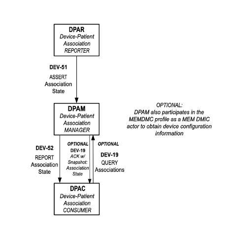

[.text-center]
= IHE Change Proposal

[.text-center]
== Tracking Information
[cols="1,1"]
|===

|IHE Domain/Program
|DEV Domain / Patient Care Device (PCD) Program

|Change Proposal ID:
|CP-PCD-NN6

|Change Proposal Status:
|Draft

|Date of last update:
|2023-06-16

|Person Assigned:
|Eldon Metz

|===

[.text-center]
== Change Proposal Summary Information

[cols="1,1"]
|===

2+^|*PCIM Foundational Changes*

|Submitter’s Name(s) and e-mail address(es):
|Eldon Metz, emetz@innovisionmedical.com

|Submission Date:
|TBD

|Integration Profile(s) affected:
|Point-of-Care Identity Management (PCIM)

|Actor(s) affected:
|Device-Patient Association Consumer +
Device-Patient Association Manager +
Device-Patient Association Reporter

|IHE Technical Framework or Supplement modified:
|PCIM Profile TI revision 1.1, dated 2018-12-07

|Volume(s) and Section(s) affected:
|Trial Implementation, Multiple Sections

2+|Rationale for Change:

After completing HIMSS showcase demonstrations and Connectathon Testing events for PCIM in 2022, followed by  discussion on design and practical implementation and roll-out within the PCIM working group meetings, the working group members agreed on foundational changes that simplify the design and align better to existing system architectures to minimize roll-out time. The following changes are proposed:

- PCD-17 (assert association) and PCD-18 (assert disassociation) transactions are deprecated and instead combining into a DEV-51 (assert association state) transaction.

- A DEV-52 (report association state) transaction is added to reflect the manager to consumer reporting of real-time association status events. A separate transaction between the manager and consumer actors than that between the reporter and manager actors is consistent with IHE assignments and it allows for different message content and constraints.

- The DEV-19 (query associations subscription) transaction is now optional and no longer includes a “snapshot” in the response. 

-	The PCD-20 transaction and DREG actor are eliminated from this specification.  References to MEM DMC capabilities to address registration and reporting of device association availability have been added.

This Change Proposal (CP) proposes changes to implement profile clarifications and positions for the above issues.

|===

|===

| _Section Appendix A_ *Actor Summary Definitions*, _modify the definitions in the table on line 213 as shown below and also adding the acroynm text in the name column and a new OID column_:

|===
[.text-left]
[underline]#Existing Table:#

[cols="1,1"]
|===
|Actor Name|Definition

|Device-Patient Association Reporter
|A system that asserts a device-patient association, disassociation, or attributes related to either such as current state or starting and ending times.

|Device-Patient Association Manager 
|A system that records, manages, and serves records of device-patient associations.

|Device-Patient Association Consumer
|A system or person that queries a Device-Patient Association Manager for device-patient association records, either as a snapshot of current associations or as a subscription for ongoing updates.

|Device Registrant
|A system (including the device itself) or person that, when the device is setup for use by a Device-Patient Association Manager, uniquely identifies a device instance that may participate in device-patient associations.

|===
[.text-left]
[underline]#Proposed Table:#

[cols="1,1,1"]
|===
|Actor Name and Acronym|Definition|Actor OID

|Device-Patient Association Reporter (DPAR)
|A system that asserts a device-patient association or disassociation with the attributes related including location, starting and ending times, and observers involved. The system may be fully automated or require human machine interaction (HMI). Provisions are made so systems may report assertions that are final or those that require additional user validation.
|1.3.6.1.4.1.19376.1.6.3.22

|Device-Patient Association Consumer (DPAC)
|A system that receives device-patient association records from the manager in real-time. Record filters can be pre-configured or optionally, dynamically added via a subscription query.
|1.3.6.1.4.1.19376.1.6.3.23

|Device-Patient Association Manager (DPAM) 
|A system that receives and manages association assertions and association state and coordinates conflict resolution. The system serves records that match device-patient association queries in real-time. The system is required to provide an HMI to allow responsible observers to validate assertions that require it.
|1.3.6.1.4.1.19376.1.6.3.24

|===

|===

|_Section Appendix B_ *Transaction Summary Definitions*, _modify the table on line 218 to update the transaction names, definitions and numbers_:

|===
[.text-left]
[underline]#Existing Table:#

[cols="1,1"]
|===
|Transaction Name and Number|Definition

|Assert Device-Patient Association
|A Device-Patient Association Reporter asserts to a Device-Patient Association Manager that a device has been associated with a patient, or updates data concerning a reported assertion.

|Assert Device-Patient Disassociation
|A Device-Patient Association Reporter asserts to a Device-Patient Association Manager that the association between a device and patient has been terminated.

|Query Device-Patient Associations
|A Device-Patient Association Consumer sends a query to a Device-Patient Association Manager concerning the devices associated with a patient or set of patients currently or at a stated past time. The Device-Patient Association Manager responds with the requested information.

|Register Device
|A Device Registrant sends, updates or deletes a record of identifying information on a device instance for storage and use by the Device-Patient Association Manager.

|===
[.text-left]
[underline]#Proposed Table:#

[cols="1,1,1"]
|===
|Transaction Name and Number|Definition|Transaction OID

|Query Associations 
(DEV-19)
|A Device-Patient Association Consumer sends an optional query to a Device-Patient Association Manager with filter criteria. The Device-Patient Association Manager  sets up a real-time subscription with the specified filter criteria applied. 
|1.3.6.1.4.1.19376.1.6.1.19.1

|Assert Association State
(DEV-51) 
|A Device-Patient Association Reporter asserts to a Device-Patient Association Manager that a device has been associated or disassociated with a patient and optional location. It may also report updated data for a previously reported assertion.
|1.3.6.1.4.1.19376.1.6.1.51.1 

|Report Association State
(DEV-52)  
|A Device-Patient Association Manager reports to a Device-Patient Association Consumer that a device has been associated or disassociated with a patient with optional location. It may also report an update for an existing association.
|1.3.6.1.4.1.19376.1.6.1.52.1

|===

|===

|*PCIM Actors, Transactions, and Content Modules*, _replace Figure 7.1-1 on page 13 with updated actor name, number and definitions_:

|===

[.text-left]
[underline]#Existing Figure:#

image::original-actor-transaction-diagram.png[]

[.text-left]
[underline]#Proposed Figure:#

|===

|*PCIM Actors, Transactions, and Content Modules*, _replace Table 7.1-1 PCIM Profile – Actors and Transactions on page 14 with updated actor names, transactions and optionality value_:

|===

[.text-left]
[underline]#Original Table:#

[cols="1,1,1,1,1"]
|===
|Actors|Transactions|Initiator or Responder|Optionality|Reference
.2+|Device-Patient Association Reporter
|Report Device-Patient Association
|
|R
|PCD TF-2 3.17

|Report Device-Patient Disassociation
|
|R
|PCD TF-2 3.18

|Device-Patient Association Consumer
|Query Device-Patient Associations
|
|O
|PCD TF-2: 3.19

|Device-Patient Registrant
|Report Registered Device Details
|
|R
|PCD TF-2: 3.20

|===
[.text-left]
[underline]#Proposed Table:#

[cols="1,1,1,1,1"]
|===
|Actors|Transactions|Initiator or Responder|Optionality|Reference

|Device-Patient Association Reporter
|Report Device-Patient Association or Disassociation
|
|R
|PCD TF-2 3.51

.2+|Device-Patient Association Consumer
|Consume Device-Patient Associations
|
|R
|PCD TF-2: 3.52
|Query Device-Patient Associations
|
|O
|PCD TF-2: 3.19

.3+|Device-Patient Manager
|Consume Device-Patient Association Assertions
|
|R
|PCD TF-2: 3.51

|Report Device-Patient Associations
|
|R
|PCD TF-2: 3.52

|Filter Device-Patient Association Reports Dynamically
|
|O
|PCD TF-2: 3.19

|===

|===

|_Section 7_ *Point-of-Care Identity Management (PCIM) Profile*, _change the paragraph on line 235_:

|===

[underline]#Existing Text:#

[.text-left]
The Point-of-Care Identity Management (PCIM) Profile is a Transport Profile specifying HL7®1
v2 standard messaging for devices and IT systems at an acute-care point-of-care to exchange and
synchronize information about the identity of specific devices collecting clinical information
about a specific patient, to:

[underline]#Proposed Text:#

[.text-left]
The Point-of-Care Identity Management (PCIM) Profile is a Transport Profile specifying HL7®1
v2 standard messaging for devices and IT systems at a point-of-care to exchange and
synchronize information about the identity of specific devices collecting clinical information
about a specific patient, to:

|===

|_Section 7.1.1.1_ *Device-Patient Association Reporter*, _change the paragraph on line 270_:

|===

[underline]#Existing Text:#

[.text-left]
The Device-Patient Association Reporter represents a system or person that is asserts that a given device is attached or removed from a specific patient. For each such event, the unique Patient ID, Device ID, and timestamp must be reported. 

[underline]#Proposed Text:#

[.text-left]
The Device-Patient Association Reporter actor asserts that a given device is associated or disassociated with a specific patient. The reporter may update existing associations. For each such event, the unique Patient ID, Device ID, and timestamp of the beginning of association or end of association shall be reported. If a location is known, it should be included in the report. Each report represents a single device patient association assertion. For each such assertion event, the unique Patient ID, Device ID, and timestamp must be reported. If the report is validated, the report observation status field shall be marked final, otherwise it shall be marked as requiring validation. 

|===

|_Section 7.1.1.2_ *Device-Patient Association Manager*, _change the paragraph on line 274_:

|===

[underline]#Existing Text:#

[.text-left]
The Device-Patient Association Manager represents a system that collects and persists information on what devices are currently or were connected to patients within a defined scope, such as a clinical unit, at a given time, and can communicate these associations as query responses, event notifications, or both. 
 

[underline]#Proposed Text:#

[.text-left]
The Device-Patient Association Manager actor collects and persists information on devices currently associated with patients within a defined scope, such as a clinical unit and shall communicate validated associations as event notifications. The system is responsible for resolving conflicts and shall provide an HMI for validating association assertions that require validation and resolving conflicts. 

|===

|_Section 7.1.1.3_ *Device-Patient Association Consumer*, _change the paragraph on line 279_:

|===

[underline]#Existing Text:#

[.text-left]
The Device-Patient Association Consumer represents a system or person that is has a
requirement to receive information on what devices are or were connected to which patients. A common example is a critical care system that charts device observations for a patient. 
 
[underline]#Proposed Text:#

[.text-left]
The Device-Patient Association Consumer actor receives information on what devices are associated with which patients. The actor initially receives current association status followed by updates in real-time. Common examples are a medical device or critical care system that charts device observations for a patient. The actor receives association updates in real-time. 

|===

|_Section 7.1.1.4_ *Device-Registrant*, _delete the paragraph on line 283_ or change to reference MEMDMC?:

|===

[.text-left]
[underline]#Existing Text:#

[.text-left]
The Device Registrant represents a system or person that maintains the list of medical devices that can be connected to a patient. The list entry for each device typically includes the device type, location (may not apply if the device is mobile), and unique identity. 
 
[.text-left]
[underline]#Proposed Text:#

[.text-left]
The IHE MEM DMC profile enables automated contributions to the list of medical devices that can be associated with a patient. 

|===

|_Section 7.1.1.4_ *Device-Registration*, _change the section title to Device Registration and delete the two paragraphs starting at line 287 and tie them into an MEM DMC reference_:

|===

[.text-left]
[underline]#Existing Text:#

[.text-left]
Where this is a person, it is most likely hospital staff that is interacting directly with the Device- Patient Association Manager through its user interface. 
Where it is a system, it may be a comprehensive device inventory system, a “gateway” system, or even the device itself. 

[.text-left]
[underline]#Proposed Text:#

[.text-left]
The list of medical devices that can be associated with the patient may be preconfigured or automated with MEM DMC. Device registration may also be manually accomplished during system setup and maintenance. Examples of information available from MEM DMC are the device model, manufacturer, serial number, and network end point (ip address, port).

|===

|*7.2 PCIM Actor Options*, change the first two paragraphs starting at line 293 to address the change in optionality and options:

|===

[.text-left]
[underline]#Existing Text:#

[.text-left]
The Device-Patient Association Consumer has two options available for receiving data from the Device-Patient Association Manager. The first option is to query the Manager for a snapshot of current associations, either by sending a patient identifier and receiving back the associated device(s) or by sending a device identifier and receiving back the associated patient. The second option is to receive an unsolicited continuous stream of association and disassociation events from the Manager as they occur. The Device-Patient Association Manager should support sending data via both methods, and the Device-Patient Association Consumer may support one or both methods. 
Options that may be selected for each actor in this profile, if any, are listed in the Table 7.2-1. Dependencies between options, when applicable, are specified in notes. 
 
[.text-left]
[underline]#Proposed Text:#

[.text-left]
The Device-Patient Association Manager may optionally filter events sent to the Device-Patient Association Consumer. The filter request to the Manager results in an immediate delivery from the manager of the current active associations via DEV-52 messages based on the filter criteria. The Consumer then receives an unsolicited continuous stream of association and disassociation events. The Device-Patient Association Manager may support this filtering option. 

[.text-left]
Options that may be selected for each actor in this profile, if any, are listed in the Table 7.2-1. Dependencies between options, when applicable, are specified in notes. 

|===

|*7.2-1 PCIM Actor Options*, _change the table near line 303_:

|===

[.text-left]
[underline]#Existing Table:#

[cols="1,1,1"]
|===
|Actor|Option Name|Reference

|Device-Patient Association Consumer 
|Snapshot Option
|7.2.1

|Device-Patient Association Consumer 
|Subscription Option
|7.2.2

|Device-Patient Association Manager 
|Snapshot Option
|7.2.1

|Device-Patient Association Manager 
|Subscription Option
|7.2.2

|Device-Patient Association Reporter 
|No options defined
|

|Device Registrant
|No options defined
|

|===
[.text-left]
[underline]#Proposed Table:#

[cols="1,1,1"]
|===
|Actor|Option Name|Reference

|Device-Patient Association Consumer 
|Filtering Option
|7.2.1

|Device-Patient Association Manager 
|Filtering Option
|7.2.1

|Device-Patient Association Reporter 
|No options defined
|

|===

|===

|*Snapshot Option*, _move and alter text to address change in query approach and option status in section 3.19, addressed later in this CP_:

|===

|===

|*Subscription Option*, _re-number to 7.2.1 and update to reflect query option changes_:

|===

[.text-left]
[underline]#Existing Text:#
[.text-left]
The snapshot option applies to query and response interactions between Device-Patient Association Consumer and Device-Patient Association Manager and specifies that the query response desired is a continuing subscription to changes in device-patient associations. 
A Device-Patient Association Consumer that supports this option shall formulate its request in the form described in Section 3.19. 

[.text-left]
[underline]#Proposed Text:#
[.text-left]
The filtering option applies to interactions between Device-Patient Association Manager and Device-Patient Association Consumer and specifies that the communication between manager and consumer is a filtered real-time delivery of changes in device-patient associations. 
[.text-left]
A Device-Patient Association Consumer that supports this option shall formulate its request in the form described in Section 3.19. 

|===

|*7.4.2.1 Use Case #1*, _combine description from 7.4.2.1 and 7.4.2.1.2 into single heading named 7.4.2.1.1 right under the name of the use case to match surrounding use case text_

|===

|===

|*7.4.2.1.1 Use Case #1 Associating Device with Patient: Process Flow*, _change title to 'Process Flow' and heading number to 7.4.2.1.2 and correct grammar in second sentence_

|===

===== 7.4.2.1.1 Process Flow

[.text-left]
[underline]#Existing Text:#
[.text-left]
This use case can be driven by an authorized user responsible for entering, verifying, or both, the
beginning and ending of an association between a device and a particular patient. The should be
based on first person awareness of the situation at the point of care. Automatic Identification and
Data Capture methods such as barcodes or RFID should be used to assist the workflow and
increase data reliability to the maximum feasible extent.

[.text-left]
[underline]#Proposed Text:#
[.text-left]
This use case can be driven by an authorized user responsible for entering, verifying, or both, the
beginning or ending of an association between a device and a particular patient. This should be
based on first person awareness of the situation at the point of care. Automatic Identification and
Data Capture methods such as barcodes or RFID should be used to assist the workflow and
increase data reliability to the maximum feasible extent.

|===

|*7.4.2.1.2 Use Case Description*, _remove this heading number and update numbers below as the text is now combined into 7.4.2.1.1 heading description_

|===

|===

|*7.4.2.1.3 Pre-conditions:*, _fix grammar in second sentence of paragraph 370--change 'Device identify' to 'Device identity'_

|===

|===

|*7.4.2.3 Use Case #3 Query for the Devices for a Patient*, _change title to 'Use Case #3 Filter Devices for a Patient'_

|===

|===

|*7.4.2.3.1 Description*, _update to reflect that retrospective queries are currently out of scope_

|=== 

[.text-left]
[underline]#Existing Text:#
[.text-left]
A Device-Patient Association Consumer may query a Device-Patient Association Manager for a list of devices associated with a particular patient at present, or at a designated time in the past, or more generally for a snapshot of the Device-Patient Association map. 

[.text-left]
[underline]#Proposed Text:#
[.text-left]
A Device-Patient Association Manager may filter association messages to a Device-Patient Association Consumer for current and ongoing device patient associations. Retrospective queries are currently out of scope. 

|===

|*7.4.2.3.2 Process Flow*, _update to eliminate query verbiage _:

|=== 

[.text-left]
[underline]#Existing Text:#
[.text-left]
For status display or for error-checking and diagnostic purposes, the Device-Patient Association Manager can respond to a targeted query by sending a query response message. 

[.text-left]
[underline]#Proposed Text:#
[.text-left]
For status display or for error-checking and diagnostic purposes, the Device-Patient Association Manager sends the Device-Patient Association Consumer the current association records for each patient it is configured to receive.

|===

|*7.4.2.2 Add Pre-conditions*, _Main Flow and Post-Conditions for Use Case #2_:

|===
[.text-left]
===== 7.4.2.2.3 Pre-conditions:

Patient is to be disassociated with a device.
Patient has been assigned unique identifier at registration which has been collected and verified at the point of care.
Device identity has been registered for use.
The identities of patient and device(s) have been collected and verified by an authorized person.
The patient has already been associated with a device.
[.text-left]
===== 7.4.2.2.4 Main Flow:

Device-Patient Association reporter originates a message with the specific information on the disassociation and its time of ending.
[.text-left]
===== 7.4.2.2.5 Post-conditions:

After completion of this use case, a record identifying the patient and the associated device and giving the end time of the association correlated with the starting time is persisted by the Device-Patient Association Manager.

|===

|*7.4.2.3 Add Pre-conditions*, _Main Flow and Post-Conditions for Use Case #3_:
|===

[.text-left]
===== 7.4.2.3.3 Pre-conditions:

Patient has been assigned unique identifier at registration which has been collected and verified at the point of care.
Device identity has been registered for use.
The identities of patient and device(s) are known to the system or person performing the filtering.
[.text-left]
===== 7.4.2.3.4 Main Flow:

A Device-Patient Association Consumer originates a message to the Device-Patient Association Manager with the specific filter information for the devices to receive filtered association reports for.
[.text-left]
===== 7.4.2.3.5 Post-conditions:

After completion of this use case, if the manager supports the filtering option, a subscription filter for the requested devices and the requesting consumer is persisted and any matching association reports are sent by the Device-Patient Association Manager to the Device-Patient Association Consumer. If the manager does not support the filtering option, an appropriate error code is sent to the consumer when the filter request message is received.

|===

|*7.4.2.4 Use Case #4 Query the Associated Patient for a Device*, _remove section_:

|=== 

|===

|*7.4.2.5 Use Case #5 Device Registrant Registers a Device with the Device-Patient Association Manager*, _remove section_:

|=== 

|===

|*7.4.2.6 Use Case #6 Query the Device Registrant for a list of candidate devices for an association*, _remove section_:

|=== 

|===

|*7.7 Out of Scope Items*, insert section 7.7 around line 448 that specifies out of scope items_:

|=== 

|===

|*7.7.1 Retrospective Queries*, insert section 7.7.1 around line 448 that specifies out of scope item_:

|=== 

[.text-left]
[underline]#Proposed Text:#
[.text-left]
An actor that supports retrospective queries was considered. For the use cases outlined, it was noted that they require accurate up-to-date patient identification for transferring patient information with observations and alarms. Retrospective queries, although useful, were considered functionality deemed secondary and for further consideration in the future.

|===

|*3.17 Assert Device-Patient Association [PCD-17]*, _rename to_: *Assert Device-Patient Association [DEV-51] and all subsequent sections are named 3.51 instead of 3.17*

|=== 

|===

|*3.17.1 Scope*, _update paragraph on line 456 to indicate both association and disassociation events are covered in the transaction_:

|=== 

[.text-left]
[underline]#Existing Text:#
[.text-left]
This transaction is used to by a Device-Patient Association Reporter to assert that an association has been established between a device and a patient, or to update information reported previously by that reporter.

[.text-left]
[underline]#Proposed Text:#
[.text-left]
This transaction is used by a Device-Patient Association Reporter to assert that an association has been established or broken between a device and a patient, or to update information reported previously by that reporter.

|===

|*3.17.2 Actor Roles*, _update table 3.17.2-1: Actor Roles to address association and disassociation_:

|=== 

[.text-left]
[underline]#Existing Table:#

[cols="1,1"]
|===

|Actor:
|Device-Patient Association Reporter

|Role:
|Reporter – the source of the assertion. Identifies the device, the patient, the authority for the association, and the effective time.

|Actor:
|Device-Patient Association Manager

|Role:
|Manager – establishes a persistent record of the association.

|===
[.text-left]
[underline]#Proposed Table:#

[cols="1,1"]
|===
|Actor|Role

|Device-Patient Association Reporter
|The source of the assertion. Identifies the device, the patient, the responsible observer or automated system that is triggering the assertion for the association or disassociation, and the effective time. If the responsible observer verifies at the reporter, the manager does not need to verify. The reporter must record the responsible observer when verification occurs. The reporter must include in the observation the status field that indicates whether the assertion requires validation or is final (already verified).

|Device-Patient Association Manager
|Establishes or updates the persistent record of the association. The manager must provide a HMI to verify association and disassociation assertions. The manager is also responsible for conflict resolution with the HMI and sending corresponding HL7 ACK error codes at commit or application levels. Note that the HMI need not be constrained to running on the same device as the manager. For example, the HMI may be in the form of a mobile app.

|===

|===

|*3.17.4.1 Device-Patient Association Report*, _update paragraph on line 469, restricting to one device patient association assertion per message_:

|=== 

[.text-left]
[underline]#Existing Text:#
[.text-left]
This is an HL7 Version 2 message giving details of the association being asserted. The message may assert association between more than one device and one patient.

[.text-left]
[underline]#Proposed Text:#
[.text-left]
This is an HL7 Version 2 message giving details of the association being asserted. The message asserts an association between one device and one patient.

|===

|*3.17.4.1.1 Trigger Events*, _update paragraph on line 473, to represent association and disassociation_:

|=== 

[.text-left]
[underline]#Existing Text:#
[.text-left]
This message is triggered at the beginning of an interval when the logical connection between a device and the data it originates and a particular patient is established, after that connection has been verified by a human user able to check its validity at the point of care.

[.text-left]
[underline]#Proposed Text:#
[.text-left]
This message is triggered when a logical connection between a device and a 
particular patient is established or removed, or when an attribute associated with an existing device-patient association has changed. If the event has been verified by a user, the message represents
a final association.

|===

|*3.17.4.1.2 Message Grammar*, _update sentence on line 793 to specify device and human instead of device, human_:

|=== 

[.text-left]
[underline]#Existing Text:#
[.text-left]
originating Reporter system and human user are authorized for their roles

[.text-left]
[underline]#Proposed Text:#
[.text-left]
originating reporter system and human user are included in the message

|===

|*3.17.4.1.2 Message Semantics*, _update last sentence on line 511, to represent association and disassociation and to suggest using a technical alert to effectively notify human user_:

|=== 

[.text-left]
[underline]#Existing Text:#
[.text-left]
If the checks are passed, the Manager establishes a record of the existence of the association and its effective time.

[.text-left]
[underline]#Proposed Text:#
[.text-left]
After these checks, the Manager logs the result and returns an appropriate positive or negative acknowledgement to the Reporter. The system design must assure that errors are indicated to the appropriate human user(s) in an effective and timely manner so that action can be taken. In this case, a technical alert should be raised using the ACM profile, the details of this are out of scope for this document. 
If the checks are passed, the Manager establishes a record of the beginning or ending of the association and the effective time.

|===

|*3.18 Assert Device-Patient Disassociation [PCD-18]*, _remove section as association and disassociation are now a single transaction_:

|=== 

|===

|*3.52 Report Device-Patient Association [DEV-52]*, _add new sections for DEV-52_:

|===

[.text-left]
[underline]#Proposed  Text:#
[.text-left]
== Report Device-Patient Association [DEV-52]

Insert in Section 3 as new Section 3.52

=== Scope

This transaction is used by a Device-Patient Association Manager to report to Device-Patient Association Consumers that an association has been established or broken between a device and a patient, or to update information reported previously.

=== Actor Roles

The roles in this transaction are defined in the following table and may be played by the actors listed:

Table 3.52.2-1: Actor Roles

|===
|Actor|Role

|Device-Patient Association Manager
|Reports confirmed association events to consumers. The manager must provide a HMI to verify association and disassociation assertions from a reporter if required, and once verified it persists the record and reports it to any consumers configured to receive the events in real-time. The manager should support filtering of messages, and may support dynamic filtering requested by the consumer. The manager must send current associations for all devices that the consumer is configured to receive reports for immediately after a connection is established.

|Device-Patient Association Consumer
|The receiver of the verified and final association report.  The consumer initially receives current association status followed by updates in real-time on a connection established by the Manager. It may optionally send a filter dynamically in the form a HL7 query or that filter may be pre-configured. When a association report is successfully received, a commit-level accept acknowledgement must be returned the the Manager.

|===

=== Referenced Standards

HL7 2.6 Chapters 2, 3, 5 and 7

=== Interaction Diagram

==== 3.52.4.1 Device-Patient Association Report

This is an HL7 Version 2 message giving details of the association being reported. The message reports an association between one device and one patient.

The manager must send this message to all configured Consumer instances.

===== 3.51.4.1.1 Trigger Events

This message is triggered when a final (validated) association or disassociation is received.

The significant content of the message is the following:

* Confirmed unique identity of patient, preferably derived from an AIDC (Automatic Identification and Data Capture) such as scanning the patient wristband or reading an RFID tag.
Code used to identify the patient must be chosen so as to be unique at least over the scope of the set of patients seen over all information systems in the institution, such as a Medical Record Number issued by the institution for the patient, or, if available, a national id number.
The type and issuing entity shall be recorded with the code.
Additional identity codes may be provided at the discretion of the institution.
Note that any code identifiable with an individual patient must by secured from misuse in accordance with applicable legal and policy procedures.
* Unique identity of Device.
This again is determined by site considerations.
It is preferable to use a universally unique identification of the individual instance of the device, such as an IEEE EUI-64 or a Unique Device Identifier such as one produced in accordance with the US FDA (or other regulatory agency) UDI standards.
If this is not possible, then another universal identification scheme such as EUI-64 or a local identification scheme allowing all device instances in the institution to be uniquely distinguished and tracked may be used.
Additional identification codes may be included.
Whatever code is used should be possible to record automatically, as manual data entry has a high error rate, and correct identification is a patient safety concern.
* Identity of the reporter system that originated the association or disassociation.
* Identity of the authorized person responsible for obtaining and visually confirming the identity information for the patient and the device.

The form of the message is similar to an unsolicited observation report, with supplementary PRT segments identifying the device, reporter system and human operator validating the association.

See Appendix 0 for details of HL7 V2 messages.

On receipt of the message, the consumer system checks for valid syntax and that the:

. originating reporter system and human user are included
. the device is a member of the set of registered device instances and has no current conflicting association recorded (e.g., a single-patient device has an active association with a different patient)
. the patient identity provided corresponds to a known person in an appropriate status (e.g., admitted)

After these checks, the consumer returns an appropriate positive or negative commit-level acknowledgement to the Manager.

If the checks are passed, the Consumer utilizes the record of the beginning or ending of the association and the effective time for the specified patient and device.
If a commit-level acknowledgement is received by the Manager, it logs the message as delivered successfully to the Consumer.

|===

|*3.19 Query Device-Patient Associations [PCD-19]*, _rename to_: *Filter Device-Patient Associations [DEV-19]*

|=== 

|===

|*Query Device-Patient Associations*, _update scope to specify the transaction is used to filter_:

|=== 

[.text-left]
[underline]#Existing Text:#
[.text-left]
This transaction is used by a Device Patient Association Consumer to access device-patient association information held by a Device Patient Association Manager.

[.text-left]
[underline]#Proposed Text:#
[.text-left]
This transaction is used by a Device Patient Association Consumer to access filtered device-patient association information held by a Device Patient Association Manager.

|===

|*3.19.1 Scope*, _add additional text describe optionality_

|=== 

[.text-left]
[underline]#Proposed Text:#
[.text-left]
As stated previously, the DEV-19 transaction is optional. If the message is accepted by the Device-Patient Association Manager, the accept acknowledgment shall contain the value CA in MSA-1.
If this message is not supported, MSA-1 shall contain the value CR, ERR-3 (HL7 Error Code) shall contain the value 200 (Unsupported Message Type), and ERR-4 (Severity) shall contain the value E.
If the DEV-19 transaction is not supported, and the network connection between the Device-Patient Association Manager and Device-Patient Association Consumer is lost, 
the Device-Patient Association Manager shall send DEV-52 messages for all current Device-Patient associations to the Device-Patient Association Consumer when network connectivity is restored. 

|===

|*3.19.2 Actor Roles*, _update use case diagram to reference DEV-19 instead of PCD-19_

|=== 

|===

|*3.19.2 Actor Roles*, _update table 3.19.2-1: Actor Roles to remove "snapshot" terminology_:

|=== 

[.text-left]
[underline]#Existing Table:#

[cols="1,1"]
|===

|Actor:
|Device-Patient Association Consumer

|Role:
|Requests information on Device-Patient Associations. This may be filtered for device, for patient, or for time interval. It may request a current “snapshot” of active associations, or optionally for an ongoing feed of device-patient association information.

|Actor:
|Device-Patient Association Manager

|Role:
|Fulfills a request from a Device-Patient Association Consumer for device-patient association information in the manner specified by the Consumer

|===
[.text-left]
[underline]#Proposed Table:#

[cols="1,1"]
|===
|Actor|Role

|Device-Patient Association Consumer
|Establishes an real-time message reporting subscription filter for Device-Patient Associations. This may be filtered for device or location. It establishes an ongoing feed of device-patient association information.

|Device-Patient Association Manager
|Fulfills a request from a Device-Patient Association Consumer for device-patient association information filtered as specified by the Consumer

|===

|===

|*3.19.4.1 Device-Patient Association Query*, _update paragraph on line 565, to eliminate snapshot and use of device association report [DEV-52] transaction_:

|=== 

[.text-left]
[underline]#Existing Text:#
[.text-left]
This message from a Device-Patient Association Consumer requests a response from a Device-Patient Association Manager containing device-patient association data. A Device-Patient Association Manager is expected to be able to service multiple Device-Patient Association Consumer systems and manage different query and response streams and communications connections with each. Whether these communications ports are preconfigured, or dynamic with appropriate node identification and authorization for each connection request, is a matter of implementation design.
There are multiple use cases:
[.text-left]
1. A request for a ‘current snapshot’ of associations filtered as specified by the query parameters.
2. A request for an ongoing real-time feed of changes in associations.
3. Possibly less important would be request for a ‘replay’ of data from a specified time period in the past.

[.text-left]
Trying to fit these cases with the array of patterns present in Chapter 5 (Queries) of the HL7 Specification presents some puzzles. This profile chooses the QSB publish-subscribe paradigm, matching option 1, as the general case and treats 2 and 3 as special cases of it using some special semantics of query parameters described below.

[.text-left]
[underline]#Proposed Text:#
[.text-left]
This message from a Device-Patient Association Consumer requests a filtered real-time event stream from a Device-Patient Association Manager containing device-patient association data. A Device-Patient Association Manager is expected to be able to service multiple Device-Patient Association Consumer systems and manage different query and response streams and communications connections with each. Whether these communications ports are pre-configured, or dynamic with appropriate node identification and authorization for each connection request, is a matter of implementation design.
This profile chooses the QSB publish-subscribe paradigm, where the request is for an ongoing real-time feed of changes in associations using special semantics of query parameters described below.

|===

|*3.19.4.1.1 Trigger Events*, _update paragraph on line 582, indicating primary purpose and eliminating out of scope concepts such as retrospective querying_:

|=== 

[.text-left]
[underline]#Existing Text:#
[.text-left]
This message is triggered by the Device-Patient Association Consumer when it requires information about a device or devices associated with a patient currently or in the past (within the period available from the Device-Patient Association Manager). It may also be used to request a continuing feed of data concerning changes in device-patient associations within the scope of the Device-Patient Association Manager.

[.text-left]
[underline]#Proposed Text:#
[.text-left]
This message is triggered by the Device-Patient Association Consumer when it requires information about current associations for devices or patients in the form of a continuing feed of data.

|=== 

|*3.19.4.1.2 Message Semantics*, _update paragraph on line 588, eliminating out of scope concepts such as retrospective querying_:

|=== 

[.text-left]
[underline]#Existing Text:#
[.text-left]
This message is a query specification. It gives the scope of the information wanted by the
Device-Patient Association Consumer in response to the query: what patients, units, devices and time periods are pertinent. See Appendix 0 for details of HL7 segment contents and semantics.

[.text-left]
[underline]#Proposed Text:#
[.text-left]
This message is a query specification. It gives the scope of the information wanted by the
Device-Patient Association Consumer in response to the query: what devices are pertinent. See Appendix 0 for details of HL7 segment contents and semantics.

|=== 

|*3.19.4.1.3 Expected Actions*, _update paragraph on line 595, eliminating snapshot querying_:

|=== 

[.text-left]
[underline]#Existing Text:#
[.text-left]
The management of the query and response connection between the Device-Patient Association Consumer and the Device-Patient Association Manager in the case of an ongoing subscription is an implementation detail, but one practical method is for the Device-Patient Association Manager to maintain an open TCP listen port to accepts connections from one or more Device- Patient Association Consumer clients and then to open an individual TCP connection with each requester that persists as long as the client is connected and the query is valid (within its time limits, if any). For a non-subscription, “snapshot”-type query, the Device-Patient Association Manager could just respond on the static connection that the query comes in on.

[.text-left]
[underline]#Proposed Text:#
[.text-left]
The management of the query and response connection between the Device-Patient Association Consumer and the Device-Patient Association Manager in the case of an ongoing subscription is an implementation detail, but one practical method is for the Device-Patient Association Manager to maintain an open TCP listen port to accepts connections from one or more Device- Patient Association Consumer clients and then to open an individual TCP connection with each requester that persists as long as the client is connected and the query is valid (within its time limits, if any).

|=== 

|*3.19.4.2 Device-Patient Association Query Response*, _update paragraph on line 604, to indicate the response is simply an Ack_:

|=== 

[.text-left]
[underline]#Existing Text:#
[.text-left]
The response carries the requested data if the Device-Patient Association Manager has any matching the specification. If there is none available, the response is in effect an empty frame with zero data records in the position that data would be expected. If the request is ill-formed (incorrect syntax or impossible query specification), an indication of the nature of the error should be returned.

[.text-left]
[underline]#Proposed Text:#
[.text-left]
The response is a commit-level acknowledgement. If the request is ill-formed (incorrect syntax or impossible query specification), an indication of the nature of the error should be returned.

|===

|*3.19.4.2.1 Trigger Events*, _update paragraph on line 610, to remove reference to snapshot option_:

|=== 

[.text-left]
[underline]#Existing Text:#
[.text-left]
This message and the activity of preparing it, is triggered in the Device-Patient Association Manager by the query request from the Device-Patient Association Consumer. This trigger may request a snapshot of current state (Snapshot Option), or request the setting up of a sequence of messages triggered by a state change in the device-patient associations (Subscription Option).

[.text-left]
[underline]#Proposed Text:#
[.text-left]
This message and the activity of preparing it, is triggered in the Device-Patient Association Manager by the query request from the Device-Patient Association Consumer. This trigger initially requests the setting up of a sequence of messages reporting all device-patient associations matching the filter criteria. Once the initial device-patient associations have been sent, subsequent changes in the device-patient association state will trigger additional messages to be sent to the Device-Patient Association Consumer as long as the current subscription is in effect. A subscription remains in effect until it is cancelled or replaced with a new subscription request by the Device-Patient Association Consumer.  

|===

|*3.20 Register Device [PCD-20]*, _remove section_:

|=== 

|===
|*Volume 2 Namespace Additions*, _update table with OIDs_:

|=== 
[.text-left]
[underline]#Existing Table:#

[cols="1,1"]
|===
|OID,Refers to
|Actor:
|Device-Patient Association Consumer

|Role:
|Requests information on Device-Patient Associations. This may be filtered for device, for patient, or for time interval. It may request a current “snapshot” of active associations, or optionally for an ongoing feed of device-patient association information.

|Actor:
|Device-Patient Association Manager

|Role:
|Fulfills a request from a Device-Patient Association Consumer for device-patient association information in the manner specified by the Consumer

|===
[.text-left]
[underline]#Proposed Table:#

[cols="1,1"]
|===
|Actor|Role

|Device-Patient Association Consumer
|Establishes an real-time message reporting subscription filter for Device-Patient Associations. This may be filtered for device or for patient. It establishes an ongoing feed of device-patient association information.

|Device-Patient Association Manager
|Fulfills a request from a Device-Patient Association Consumer for device-patient association information filtered as specified by the Consumer

|===

|=== 

|*A.1 Report Device-Patient Association and Disassociation*, _change title to Assert and Report Device-Patient Association and Disassociation and update paragraph on line 703, to reference new transaction numbering and to explain the same message is used with minor differences for assertions vs reports_:

|=== 

[.text-left]
[underline]#Existing Text:#
[.text-left]
As all of the use cases identified in this profile can be considered observations (it was observed
that device d1 was connected to patient p1 starting at t1 and ending at t2), the ORU message structure is used throughout this profile to manage associations. This description also serves for a
Report Device-Patient Disassociation – the only difference between the Association and Disassociation messages is the content of OBX-5. The Message Structure and attendant notes also serve to specify the segment pattern to be expected in responses to Query for Device-Patient Associations [PCD-19] messages. The prototype for the IHE Patient Care Device observations in this profile is the [PCD-01] in the Device Enterprise Communication Profile (PCD TF-2: 3.1), which implementers should familiarize themselves with – it serves as useful background information and contains details on some fields that are not covered in this profile.

[.text-left]
[underline]#Proposed Text:#
[.text-left]
As all of the use cases identified in this profile can be considered observations (it was observed
that device d1 was connected to patient p1 starting at t1 and ending at t2), the ORU message structure is used throughout this profile to manage associations. This description also serves for a
Report Device-Patient Disassociation – the only difference between the Association and Disassociation messages is the content of OBX-5. The Message Structure and attendant notes also serve to specify the segment pattern to be expected in Report Association State [DEV-52] messages. The prototype for the IHE Patient Care Device observations in this profile is the [PCD-01] in the Device Enterprise Communication Profile (PCD TF-2: 3.1), which implementers should familiarize themselves with – it serves as useful background information and contains details on some fields that are not covered in this profile.

Assertions and Report messages for DEV-51 and DEV-52 transactions, respectively, use the same structure, with the following differences for DEV-52:

  . A report must not have a OBX-11 status field value of 'R' (requires validation)
  . A report may contain an additional participant segment of the responsible observer (human) that validated the association using the Manager HMI 

|===

|*A.1.1 Message Structure*, _update paragraph on line 716, to reference new transaction numbering and single device per patient association in a single report_:

|=== 

[.text-left]
[underline]#Existing Text:#
[.text-left]
MSH, SFT, and UAC Segments: follow the specifications for [PCD-01] in PCD TF-2 Appendix B.1, except that in the MSH segment, MSH-21 is valued “IHE_PCD_017^IHE PCD\^1.3.6.1.4.1.19376.1.6.1.17.1^ISO” to identify it as a Report Device-Patient Association. In the context of this use case, the message is constrained to reporting association(s) for a single patient. This could be single device, single patient, or multiple devices associated to a
single patient.

[.text-left]
[underline]#Proposed Text:#
[.text-left]
MSH, SFT, and UAC Segments: follow the specifications for [PCD-01] in PCD TF-2 Appendix B.1, except that in the MSH segment, MSH-21 is valued “IHE_DEV_051^IHE PCD\^1.3.6.1.4.1.19376.1.6.1.51.1^ISO” to identify it as a Assert Device-Patient Association or “IHE_DEV_052^IHE PCD\^1.3.6.1.4.1.19376.1.6.1.52.1^ISO” to identify it as a Report Device-Patient Association. In the context of this specification, the message is constrained to reporting association(s) for a single patient and device.  

|===

|*A.1.2.1 Message Header*, _update paragraph on line 724, to reference new transaction numbering and fix typo in OID_:

|=== 

[.text-left]
[underline]#Existing Text:#
[.text-left]
Since this message is effectively an unsolicited observation report, the contents of the MSH segment follow the specifications for [PCD-01] in PCD TF-2 Appendix B.1, except that MSH-21 is valued "IHE_PCD_017^IHE PCD\^1.3.6.1.4.1.19376.1.6.4.17.1^ISO" to identify it as a message representing a device-patient association.

[.text-left]
[underline]#Proposed Text:#
[.text-left]
Since this message is effectively an unsolicited observation report, the contents of the MSH segment follow the specifications for [PCD-01] in PCD TF-2 Appendix B.1, except that MSH-21 is valued "IHE_DEV_051^IHE PCD\^1.3.6.1.4.1.19376.1.6.4.51.1^ISO" to identify it as a message representing a device-patient association.

|===

|*A.1.2.3 PV1 Patient Visit Information*, _remove sentence describing patient filter option_:

|=== 

[.text-left]
[underline]#Existing Text:#
[.text-left]
See transaction [PCD-01] for basic information (PCD TF-2 Appendix B.6).
In this profile, the PV1 segment is used to convey patient location information in PV1-3 Assigned Patient Location. This is also usable as a query filter to limit responses from the Device-Patient Association Query to matching locations.

[.text-left]
[underline]#Proposed Text:#
[.text-left]
See transaction [PCD-01] for basic information (PCD TF-2 Appendix B.6).
In this profile, the PV1 segment is used to convey patient location information in PV1-3 Assigned Patient Location.

|===

|*A.1.2.4 OBR-4 Order Request*, _modify the paragraph on line 743 on page 36-37, by modifying text and including a table of field definitions with data types and optionality_:

|=== 

[.text-left]
[underline]#Existing Text:#
[.text-left]
This segment serves as a wrapper for an association observation. It provides the association message with a unique identifier that can be used for tracking messages from all sources in the overall configuration of systems. The OBR segment also specifies the unique identifier for the patient device association service.

[.text-left]
[underline]#Proposed Text:#
[.text-left]
This segment serves as a wrapper for an association observation.
It gives the association message a unique identifier in the Filler Order Number OBR-3.
This is a required field: it acts as an association object instance identifier for tracking is used for tracking messages from all sources in the overall configuration of systems, so it must be constrained by some method of generation that assures that duplicate identifiers between sources are not possible.
It gives the timestamp of the beginning of the association (OBR-7), and when it is known, the end of the association (OBR-8).

Table A.1.2.5-1: OBR Fields

|===
| *SEQ* | *DT* | *OPT*  | *Description*

| 1
| SI
| O
| Set ID - OBR

| 3
| EI
| R
| Unique instance identifier for the association event. Must be constrained during generation to ensure duplicate identifiers between sources are not possible.

| 4
| CE
| R
| Universal Service Identifier – set to 69136^MDC_OBS_ASSOCIATION_PATIENT_DEVICE^MDC

| 7
| TS
| C
| Earliest participant involvement

| 7
| TS
| C
| Latest participant involvement

|===

The OBR shall also include the timestamp of the earliest participant involvement (OBR-7) and latest participant involvement (OBR-8) for an association or disassociation event report. 
Each report consists of two Participant Segments (PRT) and each may have timestamps for their involvement in PRT-11 and/or PRT-12. OBR-7 and OBR-8 conveys the range of time of both participants. See Table A.1.2.6-3 and Table A.1.2.6-4 for definitions of the timestamp semantics in PRT-11 and PRT-12. The logic for filling in the timestamp values for OBR-7 and OBR-8 is to examine both the PRT segments that will be sent out in the report and set OBR-7 to the earliest timestamp value and OBR-8 to the latest timestamp value. OBR-7 and 8 may contain the same timestamp.

|===

|*A.1.2.5-2*, _update table to reflect terms assigned for device-patient association and disassociation_
|===

[.text-left]
[underline]#Existing Table:#
[.text-left]

|===
| *Observation Value* | *Description*

| 0{caret}MDCX_DEV_ASSOCIATE{caret}MDC
| Device has been associated to a patient.

| 0{caret}MDCX_DEV_DISASSOCIATE{caret}MDC
| Device has been disassociated from a patient.
|===

[.text-left]
[underline]#Proposed Table:#
[.text-left]

|===
| *Observation Value* | *Description*

| 198332{caret}MDC_EVT_ASSOCIATION_PATIENT_DEVICE{caret}MDC
| Device has been associated to a patient.

| 198334{caret}MDC_EVT_DISASSOCIATION_PATIENT_DEVICE{caret}MDC
| Device has been disassociated from a patient.
|===

|===

|*A.1.2.6 PRT*, _clarify PRT segment is NOT used for patient but is used for system or device reporting assertion_

|===

[.text-left]
[underline]#Existing Text:#
[.text-left]

This segment conveys information about persons and/or devices that participated in the association, ancillary to the patient and device that are its subjects.
There will be PRT messages identifying the patient, the device, and the responsible observer of a device-patient association following an OBX message as described in Section 0.
For example:

* A nurse that established and/or validated an association
* A device gateway
* The device itself, if the patient ID is entered directly onto the device

[.text-left]
[underline]#Proposed Text:#
[.text-left]

This segment conveys information about persons and/or devices and systems that participated in the association, ancillary to the patient and device that are its subjects.
There will be PRT messages identifying the device, responsible observer and/or reporting system of a device-patient association following an OBX message as described in Section 0.
For example:

* A nurse that established and/or validated an association
* A device gateway
* A reporter system sending a non-validated assertion
* The device itself, if the patient ID is entered directly onto the device

|===

|*A.2.1 Scope*, _update paragraph on line 834, removing snapshot option and to clarify query is optional_:

|=== 

[.text-left]
[underline]#Existing Text:#
[.text-left]
This query allows a system to request a list of the device-patient associations meeting specified conditions. Note that “snapshot” and “subscription” request modes are supported.

[.text-left]
[underline]#Proposed Text:#
[.text-left]
This optional query allows a system to dynamically configure a filtered subscription for a list of the device-patient associations meeting specified conditions.

|===

|*A.2.3 Details of Device-Patient Association Query Message [PCD-19]*, _change PCD-19 to DEV-19 in section heading_:

|===

|===

|*A.2.3 Details of Device-Patient Association Query Message [PCD-19]*, _update section on line 840, removing snapshot option, updating transaction numbering, removing retrospective option, filtering by patient is no longer an option and clarifying that this query message is optional, updating associated tables_:

|=== 

[.text-left]
[underline]#Existing Text:#
[.text-left]
This message is used by a Device-Patient Association Consumer to request device-patient association information from a Device-Patient Association Manager, specifying filtering by patient identification, by location or by device identification. It may also be limited to a particular time (often the time the message is originated), a time interval, or it may specify an
open-ended time interval, signifying that the Device-Patient Association Consumer is requesting an ongoing real-time subscription to device-patient association information (possibly filtered as just described) that is received from Device-Patient Association Reporters. The query takes the form of a QSB publish and subscribe query as described in HL7 Chapter 5, Section 5.7.3.1. It is almost identical to the profile for the QSB\^Z83^QSB_Q16 trigger with ORU\^R01^ORU_R01 response trigger described in Section 5.7.3.1 of the HL7 specification except that the query parameters are different to accommodate the semantics of filtering for device-patient associations, and the observation reports given as the response to the query, while conforming to the ORU_R01 message structure, have the specific semantics of transaction Device-Patient Association Reports [PCD-17].

For identification, the arbitrary "`local`" (i.e., not issued by the HL7 organization) trigger event Z66 is used for the query/subscription message.
This applies for initial testing but is subject to change before this profile is submitted for final text.

Table A.2.3-1: Query Profile

|===
| Name | Value

| Query Statement ID
| Z66

| Type
| Publish

| Query Name
| Device Patient Association Query

| Query Trigger
| QSB{caret}Z66{caret}QSB_Q16

| Query mode
| Both

| Response Trigger
| ORU{caret}R01{caret}ORU_R01

| Query Characteristics
| Triggers a realtime subscription with filtering. No results are returned directly.

| Purpose
| Requests filtering of device-patient association records, as defined in input parameters

| Response Characteristics
| The response contains a commit-level ACK.

|===

Table A.2.3-2: QBP{caret}Z66{caret}QBP{caret}QBP_Z66 Query Grammar - QBP Message Segments

|===
| Segments | Description | HL7 Section Reference

| MSH
| Message Header Segment
| 2.15.9

| [\{SFT}]
| Software Segment
|

| [UAC]
| User Authentication Credential
| 2.14.13

| QPD
| Query Parameter Definition
| 5.5.4

| RCP
| Response Control Parameter
| 5.5.6
|===

An ACK is expected as response to this query, see the definition of the ORU{caret}R01 Message Structure in PCD TF-2

The results of a successful query results in the manager sending all [DEV-52] messages reporting current device-patient association events followed by ongoing real-time updates to device-patient association events, all filtered according to optional query parameters. If the connection is lost, the manager must continue to try and establish a new connection to the consumer, always sending the current device-patient association events matching the filter once the connection is re-established.

[.text-left]
[underline]#Proposed Text:#
[.text-left]
This message is used by a Device-Patient Association Consumer to request current device-patient association information from a Device-Patient Association Manager followed by a on-going subscription to ongoing real-time device-patient association information, specifying filtering by location or device identification.  The query takes the form of a QSB publish and subscribe query as described in HL7 Chapter 5, Section 5.7.3.1. It is almost identical to the profile for the QSB\^Z83^QSB_Q16 trigger with ORU\^R01^ORU_R01 response trigger described in Section 5.7.3.1 of the HL7 specification except that the query parameters are different to accommodate the semantics of filtering for device-patient associations, and the observation reports sent in real-time and constrained by the filtering, while conforming to the ORU_R01 message structure, have the specific semantics of transaction Device-Patient Association Reports [DEV-52].

For identification, the arbitrary "`local`" (i.e., not issued by the HL7 organization) trigger event Z66 is used for the query/subscription message.
This applies for initial testing but is subject to change before this profile is submitted for final text.

Table A.2.3-1: Query Profile

|===
| Name | Value

| Query Statement ID
| Z66

| Type
| Publish

| Query Name
| Device Patient Association Query

| Query Trigger
| QSB{caret}Z66{caret}QSB_Q16

| Query mode
| Both

| Response Trigger
| ORU{caret}R01{caret}ORU_R01

| Query Characteristics
| Returns device-patient associations as constrained in the input parameters

| Purpose
| Sends device-patient association records, filtered as defined in input parameters

| Response Characteristics
| The response contains [DEV-51] device-patient association reports known to the Device-Patient Association Manager, filtered by the query parameters.

| Based on Segment Pattern
| R01 as constrained by transaction [PCD-01] (see details in PCD TF-2 3.10 and with the semantics of transaction [PCD-17] as in this profile.
|===

Table A.2.3-2: QBP{caret}Z66{caret}QBP{caret}QBP_Z66 Query Grammar - QBP Message Segments

|===
| Segments | Description | HL7 Section Reference

| MSH
| Message Header Segment
| 2.15.9

| [\{SFT}]
| Software Segment
|

| [UAC]
| User Authentication Credential
| 2.14.13

| QPD
| Query Parameter Definition
| 5.5.4

| RCP
| Response Control Parameter
| 5.5.6
|===

For the segment pattern to be expected in the response to this query, see the definition of the ORU{caret}R01 Message Structure in PCD TF-2, which is a specialization of the ORU{caret}R01 Message Structure in HL7 Chapter 7, Section 7.3.1, ORU -- Unsolicited Observation Message (Event R01), as follows:

Table A.2.3-3: Query Response Message Structure

|===
| *Segments* | *Description*

| MSH
| Message Header

| [{ SFT }]
| Software Segment

| [UAC]
| User Authentication Credential

| PID
| Patient Identification

| [PV1]
| Patient Visit Information (for room bed)

| OBR
| Observation Request

| {
| _One group for each device being associated with patient identified in the PID_

| OBX
| Observation Result

| { PRT }
| Participation -- _One PRT segment for device, one for responsible person_

| }
|
|===

Note that this segment pattern, unlike some segment patterns, is not introduced by any “header” type extra segments, but instead is a straight sequenced of repeats of [DEV-52] messages reporting current device-patient association events followed by ongoing real-time updates to device-patient association events, filtered according to optional query parameters. If the connection is lost, the manager must continue to try and establish a new connection to the consumer, always sending the current device-patient association events once the connection is re-established.

|===

|*A.2.3.2-3 Identifiers for field, component, or subcomponent in QPD.3 User Parameters*, _update table to remove retrospective query capability by removing row for FLD PID 3.1 and last two rows for FLD OBR.7 and OBR.8_:

|===

|===

|*A.2.3.2-3 QPD Segment*, _update to remove text describing filtering by PID field_

|===

[.text-left]
[underline]#Existing Text:#
[.text-left]
The QueryTag (QPD.2) is used to identify a query instance and therefore must be unique for each query.

The User Parameters field (QPD.3) is used to specify "`filtering`" values, so that the query response can be limited to, for example, the records matching a particular Patient Identifier (by including a PID.3 specification), a particular device (by adding a Participation Device PRT specification) and so on.
If multiple specifications are given, the responding system "`AND`"s the specifications together, so that for example, a patient identifier and a device identifier specification result in the response only gives associations involving that patient and device.

The form of the User Parameters specifications in QPD.3 field uses one or more repetition of the CSC data type (separated by the HL7 repetition separator, by default the tilde character ~), one for each query parameter to be specified, with each repetition using the QSC data type.
This data type takes the form of a component specifying the field, component, or subcomponent to filter on as @<seg>.<field number>.<component number>.<subcomponent number>, followed by a logical operator component (normally EQ for "`equals`"), and a component giving the value sought for that field.
An example would be:

@PID.3.1.1{caret}EQ{caret}MR123~@PRT.10{caret}EQ{caret}PUMP1

This means limit the messages given in response to ones involving patient identifier MR123 and device identifier PUMP1.

The Device-Patient Association Manager is responsible for executing the search in accordance with the filters.
The different query parameter filters are ANDed together, that is, only associations where all query parameters match the sought value will be sent by the Device-Patient Association Manager.

Where the association records have query parameter fields that are repeated (as for example where multiple patient identifiers of different Identifier Types, or multiple device identifiers of different Identifier Types, are present), the Device-Patient Association Manager will consider the association record matched and send it if any value present in any repeat of the repeated field matches the sought value without regard to the Identifier Type.

[.text-left]
[underline]#Proposed Text:#
[.text-left]
The QueryTag (QPD.2) is used to identify a query instance and therefore must be unique for each query.

The User Parameters field (QPD.3) is used to specify "`filtering`" values, so that the query response can be limited to, for example, the records matching a particular Assigned Location (by including a PV1.3.1 specification), a particular device (by adding a Participation Device PRT specification) and so on.
If multiple specifications are given, the responding system "`AND`"s the specifications together, so that for example, a patient identifier and a device identifier specification result in the response only gives associations involving that patient location and device.

The form of the User Parameters specifications in QPD.3 field uses one or more repetition of the CSC data type (separated by the HL7 repetition separator, by default the tilde character ~), one for each query parameter to be specified, with each repetition using the QSC data type.
This data type takes the form of a component specifying the field, component, or subcomponent to filter on as @<seg>.<field number>.<component number>.<subcomponent number>, followed by a logical operator component (normally EQ for "`equals`"), and a component giving the value sought for that field.
An example would be:

@PV1.3.1{caret}EQ{caret}MICU~@PRT.10{caret}EQ{caret}PUMP1

This means limit the messages given in response to ones involving patient location at point of care MICU and device identifier PUMP1.

The Device-Patient Association Manager is responsible for executing the search in accordance with the filters.
The different query parameter filters are ANDed together, that is, only associations where all query parameters match the sought value will be sent by the Device-Patient Association Manager.

Where the association records have query parameter fields that are repeated (as for example where multiple patient identifiers of different Identifier Types, or multiple device identifiers of different Identifier Types, are present), the Device-Patient Association Manager will consider the association record matched and send it if any value present in any repeat of the repeated field matches the sought value without regard to the Identifier Type.

|=== 

|*A.2.4-2 RCP Response Control Parameter for Field Description and Commentary*, _Set Response Modality row Description to "R for Real time"_:

|===

|===

|*A.2.4 RCP Segment*, _update text between line 925 and 938, removing bolus text and clarifying real-time configuration_:

|=== 

[.text-left]
[underline]#Existing Text:#
[.text-left]
The supported values of RCP-3 Response Modality are R (Real Time) or T (Bolus).
In bolus mode all the available associations are sent at once. A Device-Patient Association Manager supporting the Snapshot Option must support this mode. The Device-Patient Association Consumer wanting a continuous real-time feed of association events may need to make a bolus query first to get all existing associations meeting the desired filter specification to
930 get the starting state.
In real-time mode, association records are sent as they arrive at the Device-Patient Association Manager. A Device-Patient Association Manager supporting the Snapshot Option must support this mode of operation, and a Device-Patient Association Consumer supporting the Snapshot option must be able to process the segment pattern.
935 Because the segment pattern for real-time mode has no start or end indication, the Device-Patient Association Manager will signal the completion of a bolus query by closing the connection to the Device-Patient Association Consumer. The Device-Patient Association Consumer will then make a new connection for the real-time continuing query.

[.text-left]
[underline]#Proposed Text:#
[.text-left]
The supported values of RCP-3 Response Modality is R (Real Time).
The Device-Patient Association Consumer must support receiving a continuous real-time feed of association events and will receive all existing associations when the connection is first established that meet the desired filter specification to get the starting state. After that initial state is received, association records are sent as they arrive at the Device-Patient Association Manager. The Device-Patient Association Consumer can optionally configure (or reconfigure) filter criteria and even cancel the continuing real-time query dynamically. 

|===

|*A.3 Register Device*, _remove section_:

|===

|===

|*A.4 Example Messages*, _insert a sentence that adds clarity on timestamp range to the description on line 981, on page 49_:

|=== 

[.text-left]
[underline]#Existing Text:#
[.text-left]
Example 1: At 12:00, Nurse Diesel connected patient Spaniel to a continuous physiological monitor with ID MON5588.
At 12:30, she records the association on the Critical Care application.
As she is an RN and has witnessed and entered the association on the Critical Care system, this is considered a validated association.
This message would be sent from the Critical Care system in the role of Association Reporter to the Association Manager.

[.text-left]
[underline]#Proposed Text:#
[.text-left]
Example 1: At 12:00, Nurse Diesel connected patient Spaniel to a continuous physiological monitor with ID MON5588. At 12:30, she records the association on the Critical Care application. As she is an RN and has witnessed and entered the association on the Critical Care system, this is considered a validated association. This message would be sent from the Critical Care system in the role of Association Reporter to the Association Manager. Note that since Nurse Diesel recorded the association 30 minutes after the association occurred, the timestamps for OBR-7 and OBR-8 capture that range of time in the OBR wrapper segment. Additionally, each PRT segment provides specific time for each participant. For the device equipment, when that association occurred and for the responsible observer Nurse Diesel, when it was recorded.

|===

|*A.4 Example Messages*, _update reporter message for Example 1 on line 985 to use the new transaction numbering_:

|=== 

[.text-left]
[underline]#Existing Text:#
[.text-left]
....
|AL||8859/1|||IHE_PCD_017^IHE PCD^1.3.6.1.4.1.19376.1.6.4.17^ISO
....

[.text-left]
[underline]#Proposed Text:#
[.text-left]
....
|AL||8859/1|||IHE_DEV_051^IHE PCD^1.3.6.1.4.1.19376.1.6.4.51.1^ISO
....

|===

|*A.4 Example Messages*, _modify the OBR segment on line 988 on page 50_:

|=== 

[.text-left]
[underline]#Existing OBR segment:#
[.text-left]
....
OBR|||15404652
....

[.text-left]
[underline]#Proposed OBR segment:#
[.text-left]
....
OBR|||15404652|69136^MDC_OBS_ASSOCIATION_PATIENT_DEVICE ^MDC|||20160726120000|20160726123000
....

|===

|*A.4 Example Messages*, _update manager application level acknowledgement for Example 1 on line 1005 to use the new transaction numbering_:

|=== 

[.text-left]
[underline]#Existing Text:#
[.text-left]
....
||8859/1|||IHE_PCD_051^IHE PCD^1.3.6.1.4.1.19376.1.6.4.51.1^ISO
....

[.text-left]
[underline]#Proposed Text:#
[.text-left]
....
||8859/1|||IHE_DEV_051^IHE PCD^1.3.6.1.4.1.19376.1.6.4.51.1^ISO
....

|===

|*A.4 Example Messages*, _update manager application level acknowledgement for Example 2 on line 1019 to use the new transaction numbering_:

|=== 

[.text-left]
[underline]#Existing Text:#
[.text-left]
....
7|||AL|AL||8859/1|||IHE_PCD_017^IHE PCD^1.3.6.1.4.1.19376.1.6.4.17^ISO
....

[.text-left]
[underline]#Proposed Text:#
[.text-left]
....
7|||AL|AL||8859/1|||IHE_DEV_051^IHE PCD^1.3.6.1.4.1.19376.1.6.4.51.1^ISO
....

|===

|*A.4 Example Messages*, _modify the OBR segment on line 1022 on page 51_:

|=== 

[.text-left]
[underline]#Existing OBR segment:#
[.text-left]
....
OBR|||15404697
....

[.text-left]
[underline]#Proposed OBR segment:#
[.text-left]
....
OBR|||15404697|69136^MDC_OBS_ASSOCIATION_PATIENT_DEVICE^MDC||20160726160000|20160726160000
....

|===

|*A.4 Example Messages*, _Remove Example 3 for registration, lines 1039-1047_:

|=== 

|===

|*A.4 Example Messages*, _update reference for Example 4 on line 1057 to use the new transaction numbering_:

|=== 

[.text-left]
[underline]#Existing Text:#
[.text-left]
The Device-Patient Association Manager responds by starting a continuous stream of Device- Patient Association [PCD-17] messages, starting with message(s) giving the current device
associations of the patient (which will require the Device-Patient Association Manager to access that information and format it in [PCD-17] form).

[.text-left]
[underline]#Proposed Text:#
[.text-left]
The Device-Patient Association Manager responds by starting a continuous stream of Report Association [DEV-52] messages, starting with message(s) giving the current device
associations of the patient (which will require the Device-Patient Association Manager to access that information and format it in [DEV-52] form).

|===

|*A.4 Example Messages*, _add disassociate example on page 51_:

|=== 

[.text-left]
[underline]#Proposed Text:#
[.text-left]
Example 4. At 23:00, Nurse Ratched disconnected patient McMurphy from the physiological monitor previously connected in Example 2. She presses a button and then confirms causing the disassociation to be asserted.

....
MSH|^~\&|MonitorGateway||AssocMgr||20160726230000||ORU^R01^ORU_R01|12d1586|P|2.7|||AL|AL||8859/1|||IHE_DEV_051^IHE PCD^1.3.6.1.4.1.19376.1.6.4.51^ISO
PID|||AB60001^^^A\^PI||McMurphy^R^P^^^^L
PV1||E|3 WEST ICU^3001^1
OBR|||15404712|69136^MDC_OBS_ASSOCIATION_PATIENT_DEVICE^MDC|||20160726230000|20160726230000
OBX|1|CWE|68487^MDC_ATTR_EVT_COND^MDC||198334^MDC_EVT_DISASSOCIATION_PATIENT_DEVICE^MDC||||||R
PRT|1|UC||EQUIP||||||3 WEST ICU^3001^1|MON5588^^231A8456B1CB2366^EUI-64||20160726230000
PRT|1|UC||AUT||||||3 WEST ICU^3001^1|MON5588^^231A8456B1CB2366^EUI- 64||20160726230000
....

